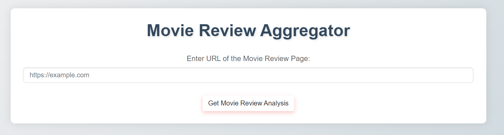
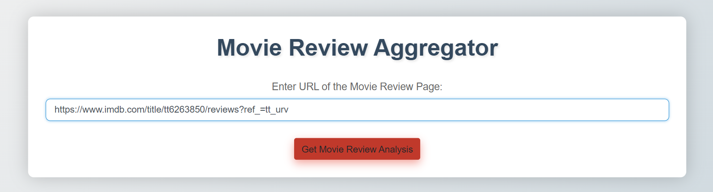
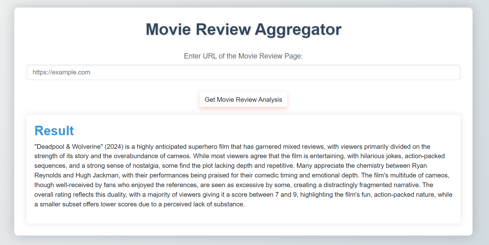

# Movie Review Aggregator

This project is a web-based tool designed to aggregate and analyze movie reviews by scraping content from movie review web pages. The website utilizes the Firecrawl SDK to extract the review content from the provided URL and employs the Gemini API to generate insights and summaries of the reviews. This tool helps users quickly understand the general sentiment and key points of movie reviews from various sources.

## Features

- **Scrape Movie Review Data**: Utilizes the Firecrawl SDK to extract relevant content from movie review page URLs provided by the user.
- **Review Analysis**: Uses the Gemini API to analyze the scraped content, generating a summary of the reviews and highlighting key insights about the movie's reception.
- **User-Friendly Interface**: Provides a simple and intuitive interface for users to input URLs and view analysis results.
- **Responsive Design**: The website design is fully responsive, ensuring a seamless experience on both desktop and mobile devices.

## Technologies Used

- **Firecrawl SDK**: For scraping movie review content from specified URLs.
- **Gemini API**: For analyzing the scraped content and generating summaries and insights from the reviews.
- **Python**: The core programming language used for backend development and integrating Firecrawl and Gemini.
- **Flask**: A lightweight WSGI web application framework used to build the backend and serve the web pages.
- **HTML/CSS**: For frontend development, providing a modern and responsive user interface.

## How the Website Looks

Below are screenshots showing different parts of the website:

*Home page with input form for movie review page URL.*

*Page showing the results after scraping and processing the movie review.*

